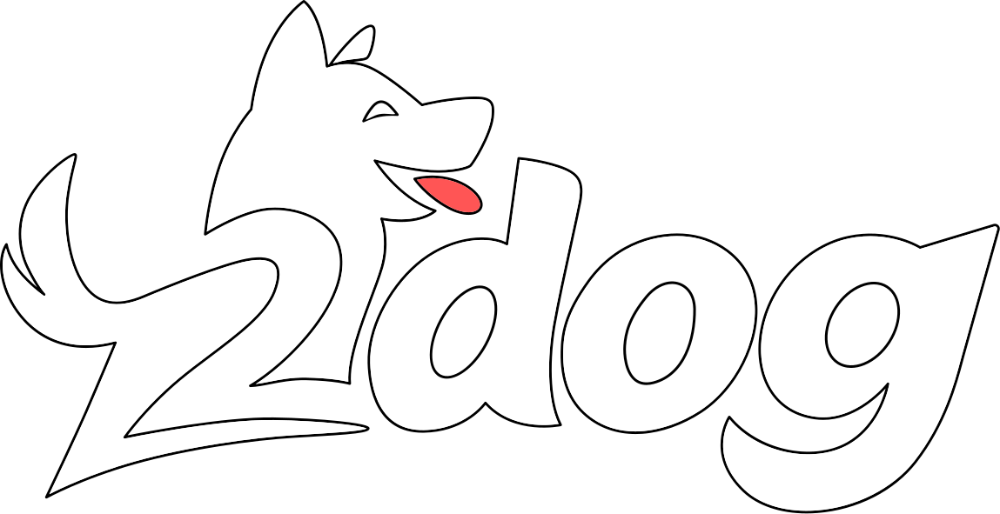

# How *do you* pronounce `Godot` ? 🦴

<p align="center">
  
</p>

> *"Godot, or to dog... is it even a question?"*

This library lets your C# application code start and pump Godot's MainLoop - not the other way around.

---

## What is 2dog?

**2dog** is a .NET/C# front-end for [Godot Engine](https://github.com/godotengine/godot) that inverts the traditional architecture. Instead of having Godot's process and scene tree drive your application, **you** now control Godot as a library.

Think of it like this: Godot is your loyal companion that follows your lead, learns new tricks, and does exactly what you tell it to. All this while still having all the capabilities of the full engine.

```cs
using twodog;

using var engine = new Engine("myapp", "./project");
using var godot = engine.Start();

// Load a scene
var scene = GD.Load<PackedScene>("res://game.tscn");
engine.Tree.Root.AddChild(scene.Instantiate());

// Run the main loop
while (!godot.Iteration())
{
    // Your code here – every frame
}
```

### What does this mean?

- 🎮 **Full Godot Power** – access the complete GodotSharp API: scenes, physics, rendering, audio, input – everything Godot can do
- 🔄 **Inverted Control** – your .NET process controls Godot, not the other way around
- 🧪 **First-Class Testing** – built-in xUnit fixtures for testing Godot code, run headless in CI/CD pipelines

---

## Features

- Godot as an embedded library (libgodot)
- Full GodotSharp API access
- Custom .NET-first project structure
- Three build configurations: Debug, Release, and Editor (with `TOOLS_ENABLED`)
- xUnit test fixtures (`GodotFixture`, `GodotHeadlessFixture`)
- `dotnet new` project templates
- Headless mode for servers and CI/CD

> **Note:** Massively WIP! With the Godot 4.6 release, we're now working in shipping a slightly customized libgodot in bespoke nuget packages. This will eliminate the local build requirement, and you can just use 2dog as a package.

---

## Quick Start

### Prerequisites
- .NET SDK 8.0 or later
- Python (with uv) – for building from source

### Using Templates (Recommended)

```bash
dotnet new install 2dog.Templates   # Install template (pending NuGet release)
dotnet new 2dog -n MyGame           # Create project
cd MyGame
dotnet run                          # Run the app
```

> **Note:** Templates are pending NuGet release. For now, install locally: `dotnet new install ./templates/twodog`

### Building from Source

1. **Clone and initialize submodules**
```bash
git clone --recursive https://github.com/outfox/2dog
cd twodog
```

2. **Build Godot** (required on fresh checkout)
```bash
uv run poe build-godot
```

3. **Build .NET packages** (required on fresh checkout)
```bash
uv run poe build
```

> You can also run `uv run poe build-all` to do steps 2 and 3 in one go.

4. **Run the demo**
```bash
dotnet run --project demo
```

### Build Configurations

```bash
dotnet build -c Debug    # Development with debug symbols
dotnet build -c Release  # Optimized production build
dotnet build -c Editor   # Editor tools with TOOLS_ENABLED
```

> Currently tested on Linux and Windows only. macOS support is WIP.

---

## Documentation

Full documentation at **[2dog.dev](https://2dog.dev)**

- [Getting Started](https://2dog.dev/getting-started) – installation and first project
- [Core Concepts](https://2dog.dev/concepts) – architecture and design
- [Build Configurations](https://2dog.dev/build-configurations) – Debug, Release, and Editor modes
- [API Reference](https://2dog.dev/api-reference) – Engine, GodotInstance, and more
- [Testing with xUnit](https://2dog.dev/testing) – test fixtures and CI/CD setup
- [Project Templates](https://2dog.dev/templates) – scaffolding new projects

---

## Join the Pack

Questions? Ideas? Want to teach 2dog new tricks?

[](https://discord.gg/GAXdbZCNGT)

---

## Acknowledgements

Inspired by and built upon Ben Rog-Wilhelm's [libgodot_example](https://github.com/zorbathut/libgodot_example/tree/csharp).
*You're the GOAT. Or a [DIESEL HORSE](https://diesel.horse). Same difference!*

---

#### *No squirrels were harmed in the making of this README.*
