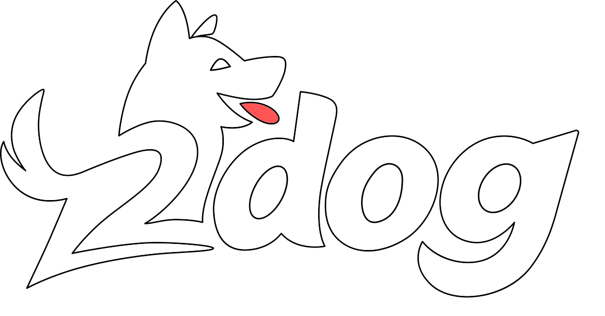

# How *do you* pronounce `Godot` ? 🦴



> *"Godot, or to dog... is it even a question?"*

This libary lets your C# application code start and pump Godot's MainLoop - not the other way around.

---

## What is 2dog?

**2dog** is a .NET/C# front-end for [Godot Engine](https://github.com/godotengine/godot) that inverts the traditional architecture. Instead of having Godot's process and scene tree drive your application, **you** now control Godot as a library.

Think of it like this: Godot is your loyal companion that follows your lead, learns new tricks, and does exactly what you tell it to. All this while still having all the capabilities of the full engine.

```cs
// Program.cs
using Engine = twodog.Engine;

using var engine = new Engine("game", "project");
using var godot = engine.Start();

while (!godot.Iteration())
{
   // .... and we're off the leash!
   // you can access the SceneTree via engine.Tree
}
```

### What does this mean?

- ✨ **Everything Godot can do**, 2dog can do
- 🎯 **Plus** direct control over engine initialization, lifecycle, and integration
- 🔧 **Plus** freedom to structure your project however you want
- 🚀 **Plus** first-class .NET tooling and workflows

---

## Features

### Current
- Godot as an embedded library (libgodot)
- Full GodotSharp API access
- Custom .NET-first project structure
- File-centric architecture

### Planned
- **TRS transforms** using the [**fenn**ecs](https://fennecs.net) entity-component system
- Novel approach to scene and material definitions
- *and more tricks to teach this dog...*

> **Note:** Massively WIP! Once Godot 4.6 releases, the local build requirements should be simplified.

---

## Quick Start

### Prerequisites
- .NET SDK 8.0 or later
- Python (with uv)

### Build & Run

1. **Clone and initialize submodules**
```bash
   git submodule update --init --recursive
```

2. **Build Godot**
```bash
   uv run build.py
```

3. **Run the demo**
```bash
   dotnet run --project demo
```

> Currently tested on Linux only. Windows/macOS support coming soon™

---

## Join the Pack

Questions? Ideas? Want to teach this dog new tricks?

[](https://discord.gg/GAXdbZCNGT)

---

## Acknowledgements

Inspired by and built upon Ben Rog-Wilhelm's [libgodot_example](https://github.com/zorbathut/libgodot_example/tree/csharp).  
*You're the GOAT. Or a [DIESEL HORSE](https://diesel.horse). Same difference!*

---

#### *No squirrels were harmed in the making of this README.*
