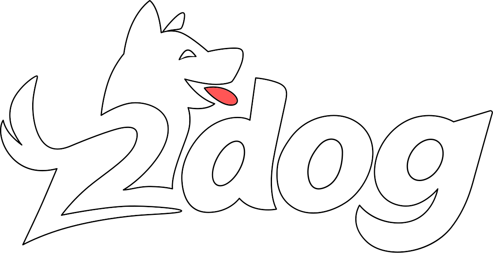

# How *do you* pronounce `Godot`? 🦴

<p align="center">
  
</p>

[](https://discord.gg/GAXdbZCNGT)
[](https://www.nuget.org/packages/2dog/)
[](https://github.com/outfox/2dog/actions/workflows/build-natives.yml)
[](https://github.com/outfox/2dog/actions/workflows/ci.yml)

### 🦴 2dog is still Godot... just backward!

2dog packages Godot as a library (a slightly modified [`libgodot`](https://github.com/godotengine/godot/pull/110863)) hostable by .NET applications. In other words: Godot normally loads .NET, now .NET loads Godot.

That enables browser publishing, ordinary `dotnet` tooling, and many automations like unit testing.


## Getting Started

Full documentation at **[2dog.dev](https://2dog.dev)**.


### Existing Project (Recommended)

2dog preserves your existing game content, and there is no tool installation step. You should make a backup, but most of its changes are optional additions, not modifications.

```bash
dnx 2dog convert path/to/MyGame
cd path/to/MyGame
dotnet run --project MyGame.2dog
```


### Start a New Project

Install the project template once, then create the same complete layout from scratch:

```bash
dotnet new install 2dog
dotnet new 2dog -n MyGame
cd MyGame
dotnet run --project MyGame.2dog
```

In either case, thge famliar Godot workflow still works:

```bash
godot-mono --editor . # or Godot_v4.7.1-stable_mono_win64.exe, etc.
```


## Exporting for the web

The generated .NET app can also be published to WASM (HTML5 / Web Browser)

```bash
dotnet workload install wasm-tools
dotnet tool install --global dotnet-serve
dotnet publish MyGame.web
dotnet serve --directory MyGame.web/AppBundle
```

See [Web / Browser](https://2dog.dev/web.html) for the development loop,
deployment options, and current limitations.


## Project Structure

2dog mainly adds subdirectories with additional "hosts" that can run your Godot project. These use `libgodot` instead of the normal export templates or editor executable.

```text
MyGame/                       Godot project and solution root
├── project.godot             Scenes, scripts, assets, project settings
├── MyGame.csproj             Godot C# game assembly
├── MyGame.2dog/              Desktop .NET host
├── MyGame.web/               Browser WebAssembly host
└── MyGame.tests/             Headless xUnit host
```

The nested hosts carry `.gdignore`, so Godot ignores them. The game project
remains clean and editor-friendly while each host gets its own entry point and
dependencies.


## Requirements and Status

- .NET SDK 10.0 or later
- Godot 4.7.x official .NET editor only when you want to edit scenes visually
- Supported platforms: `win-x64`, `linux-x64`, and `osx-arm64`
- Packages are available on [NuGet](https://www.nuget.org/packages/2dog) and [GitHub](https://github.com/outfox/2dog/releases)


## Teach 2dog New Tricks

Want to work on 2dog itself? Clone with submodules, then build the native and .NET packages:

```bash
git clone --recursive https://github.com/outfox/2dog
cd 2dog
uv run poe build-all
```

Run the demo with `dotnet run --project demo/demo.2dog` and the tests with
`dotnet test twodog.tests`.


## Join us at the Dog Park:

We have a dedicated channel for 2dog on the ⤜outfox⤏ Discord:

[](https://discord.gg/GAXdbZCNGT)

---

### *No squirrels were harmed in the making of this README.*
