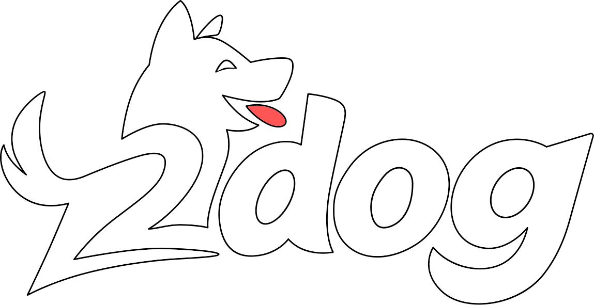

<p align="center">
  
</p>

[](https://discord.gg/GAXdbZCNGT)
[](https://www.nuget.org/packages/2dog/)
[](https://github.com/outfox/2dog/actions/workflows/ci.yml)

# 🦴 2dog is Godot... just backward!

Godot normally loads .NET, now .NET loads Godot.

2dog packages Godot as a library (a slightly modified [`libgodot`](https://github.com/godotengine/godot/pull/110863)) that .NET applications can host. Because .NET is in charge, you get browser publishing, the ordinary `dotnet` tooling, and automation such as unit tests.

We ship pre-built native libraries, so you do not have to compile Godot yourself.

Oh btw., this means you can [export Godot C# to the web](https://2dog.dev/web.html) using 2dog.


## Getting started

Full documentation at **[2dog.dev](https://2dog.dev)**.


### Existing project (recommended)

2dog adds nested .NET hosts without moving your existing Godot project.

```bash
cd path/to/MyGame
dnx 2dog add                  # pick the hosts you want, then confirm
dotnet run --project MyGame.2dog
```

Run `dnx 2dog add` again to add another host.


### New project

```bash
dnx 2dog new MyGame
cd MyGame
dotnet run --project MyGame.2dog
```

The package also provides a `dotnet new` template:
`dotnet new install 2dog && dotnet new 2dog -n MyGame`.

In either case, the familiar Godot workflow still works:

```bash
godot-mono --editor . # or Godot_v4.7.2-stable_mono_win64.exe, etc.
```


## Exporting for the web

You can also publish the generated .NET app to `browser-wasm` for the browser.

```bash
dotnet workload install wasm-tools
dotnet tool install --global dotnet-serve
dotnet publish MyGame.web
dotnet serve --directory MyGame.web/AppBundle
```

See [Web / Browser](https://2dog.dev/web.html) for the development loop,
deployment options, and current limitations.


## Project structure

2dog mainly adds subdirectories with "hosts" that run your Godot project. The hosts use `libgodot` instead of the export templates or the editor executable.

```text
MyGame/                       Godot project and solution root
├── project.godot             Scenes, scripts, assets, project settings
├── MyGame.csproj             Godot C# game assembly
├── MyGame.2dog/              Desktop .NET host
├── MyGame.web/               Browser WebAssembly host
└── MyGame.tests/             Headless xUnit host
```

Each nested host carries a `.gdignore`, so Godot ignores it. Your game project stays as it was, and each host
has its own entry point and dependencies.


## Requirements and status

- .NET SDK 10.0 or later, with the `wasm-tools` workload
- Godot 4.7.x official .NET editor (only when you want to edit scenes visually)
- Supported build platforms: `win-x64`, `linux-x64`, and `osx-arm64`
- Supported RIDs for published builds: `win-x64`, `linux-x64`, `osx-arm64`, `browser-wasm`
- Packages available on [NuGet](https://www.nuget.org/packages/2dog) and [GitHub](https://github.com/outfox/2dog/releases)


## Dogs and robots are nice

🦴♥️👾 **2dog** is proudly made by human maintainers and contributors. We permit extensive use of LLMs:
- Forked `libgodot` features/fixes consist of similar amounts of human-written and machine-written code
- Commits/PRs are reviewed & gated by both humans and machines (over 90%/90%) and signed by humans
- .NET Host applications are mostly human-written, while boilerplate assets (e.g. XAML) are mostly machine-written
- Configurations, tools, smoke tests, CSS, MSBuild XML, and CI workflows are overwhelmingly LLM-maintained
- Documentation aims to be human-authored, but new feature docs are generated and later gradually rewritten
- Releases on NuGet use Trusted Publishing and may only be invoked via direct human interaction


## Teach 2dog new tricks

Want to work on 2dog itself? Clone with submodules, then build the native and .NET packages:

```bash
git clone --recursive https://github.com/outfox/2dog
cd 2dog
uv run poe build-all
```

Run the showcase with `dotnet run --project demos/showcase/showcase.2dog` and the tests with
`dotnet test twodog.tests`.


## Join us at the dog park

We have a dedicated channel for 2dog. Come say hello!

[](https://discord.gg/GAXdbZCNGT)

---

### *No squirrels were harmed in the making of this README.*
